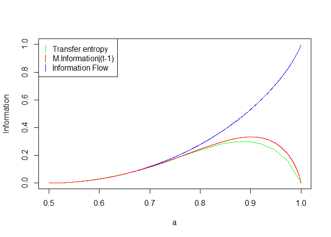

<!-- README.md is generated from README.Rmd. Please edit that file -->

# Markov.dir.info

<!-- badges: start -->
<!-- badges: end -->

The goal of this collection is to simulate the specific class of Markov
chains and calculate relevant information theory-based measures. The
code is oriented around `MarkovProcess` S4 class object.

## Installation

You can install the development version of `Markov.dir.info` like so:

``` r
install_github("JacekZgud/Directed-Information-estimation-for-Markov-chains")
```

## Example

This is a basic example which shows you how to use the library.

### Initializing `MarkovProcess` class:

``` r
library(Markov.dir.info)

# parametrise the code
node_dim = 3
nodes = 3
work_names = tail(LETTERS, nodes)

# define parent structure
ParentStructure = matrix(nrow = nodes, ncol = nodes, data = 0)
rownames(ParentStructure) = colnames(ParentStructure) = work_names

# define the parent structure of nodes
diag(ParentStructure) = 1
ParentStructure[2, 3] = 1
ParentStructure[3, 2] = 1
ParentStructure[1, 2] = 1
ParentStructure[2, 1] = 1

#------------------------------------------------------------------------
# initialize Markov Process class 
process = MarkovProcess(node_dim, nodes, ParentStructure, work_names)
process@trans_prob
#> $X
#> Key: <X, Y>
#>        X     Y     prob_0     prob_1     prob_2
#>    <int> <int>      <num>      <num>      <num>
#> 1:     0     0 0.05775076 0.50658561 0.43566363
#> 2:     0     1 0.34134805 0.27079227 0.38785968
#> 3:     0     2 0.92307692 0.04751131 0.02941176
#> 4:     1     0 0.35261923 0.46442533 0.18295543
#> 5:     1     1 0.15782313 0.42040816 0.42176871
#> 6:     1     2 0.02908587 0.57340720 0.39750693
#> 7:     2     0 0.31044432 0.51990767 0.16964801
#> 8:     2     1 0.32935086 0.35085623 0.31979291
#> 9:     2     2 0.45818505 0.06761566 0.47419929
#> 
#> $Y
#> Key: <X, Y, Z>
#>         X     Y     Z      prob_0      prob_1      prob_2
#>     <int> <int> <int>       <num>       <num>       <num>
#>  1:     0     0     0 0.473404255 0.266489362 0.260106383
#>  2:     0     0     1 0.330373002 0.184724689 0.484902309
#>  3:     0     0     2 0.107721046 0.499377335 0.392901619
#>  4:     0     1     0 0.239669421 0.574380165 0.185950413
#>  5:     0     1     1 0.475942783 0.498049415 0.026007802
#>  6:     0     1     2 0.694541231 0.293844367 0.011614402
#>  7:     0     2     0 0.322857143 0.371904762 0.305238095
#>  8:     0     2     1 0.383091149 0.101717305 0.515191546
#>  9:     0     2     2 0.645559846 0.350579151 0.003861004
#> 10:     1     0     0 0.009626955 0.399518652 0.590854392
#> 11:     1     0     1 0.243462579 0.320108206 0.436429216
#> 12:     1     0     2 0.248979592 0.372335601 0.378684807
#> 13:     1     1     0 0.232513266 0.469368066 0.298118669
#> 14:     1     1     1 0.535123967 0.109504132 0.355371901
#> 15:     1     1     2 0.338485317 0.293663060 0.367851623
#> 16:     1     2     0 0.095037847 0.197645080 0.707317073
#> 17:     1     2     1 0.335918854 0.454653938 0.209427208
#> 18:     1     2     2 0.453914767 0.404360753 0.141724480
#> 19:     2     0     0 0.653702319 0.096484667 0.249813014
#> 20:     2     0     1 0.356771874 0.322013584 0.321214543
#> 21:     2     0     2 0.409385921 0.243634548 0.346979531
#> 22:     2     1     0 0.305282842 0.453950444 0.240766713
#> 23:     2     1     1 0.275822928 0.375141884 0.349035187
#> 24:     2     1     2 0.077837838 0.006486486 0.915675676
#> 25:     2     2     0 0.187105816 0.201822004 0.611072179
#> 26:     2     2     1 0.360480641 0.632176235 0.007343124
#> 27:     2     2     2 0.073170732 0.246225319 0.680603949
#>         X     Y     Z      prob_0      prob_1      prob_2
#> 
#> $Z
#> Key: <Y, Z>
#>        Y     Z    prob_0     prob_1    prob_2
#>    <int> <int>     <num>      <num>     <num>
#> 1:     0     0 0.4152139 0.34706815 0.2377179
#> 2:     0     1 0.4578246 0.37569367 0.1664817
#> 3:     0     2 0.2001461 0.67202337 0.1278305
#> 4:     1     0 0.3785770 0.29350348 0.3279196
#> 5:     1     1 0.4227567 0.07030527 0.5069380
#> 6:     1     2 0.4680990 0.09960938 0.4322917
#> 7:     2     0 0.3849338 0.12996689 0.4850993
#> 8:     2     1 0.4264069 0.26017316 0.3134199
#> 9:     2     2 0.3860640 0.43502825 0.1789077

# example of quick manual conditional probability changes:

process2 = MarkovProcess(node_dim, nodes, ParentStructure, work_names)
process2@trans_prob$X$prob_0 = c(0.05, 0.05, 0.90, 0.90, 0.05, 0.05, 0.90, 0.90, 0.1)
process2@trans_prob$X$prob_1 = c(0.90, 0.90, 0.05, 0.05, 0.90, 0.90, 0.05, 0.05, 0.1)
process2@trans_prob$X$prob_2 = c(0.05, 0.05, 0.05, 0.05, 0.05, 0.05, 0.05, 0.05, 0.8) 
process2@trans_prob$X
#> Key: <X, Y>
#>        X     Y prob_0 prob_1 prob_2
#>    <int> <int>  <num>  <num>  <num>
#> 1:     0     0   0.05   0.90   0.05
#> 2:     0     1   0.05   0.90   0.05
#> 3:     0     2   0.90   0.05   0.05
#> 4:     1     0   0.90   0.05   0.05
#> 5:     1     1   0.05   0.90   0.05
#> 6:     1     2   0.05   0.90   0.05
#> 7:     2     0   0.90   0.05   0.05
#> 8:     2     1   0.90   0.05   0.05
#> 9:     2     2   0.10   0.10   0.80
```

### Calculating transition matrix and stationary probability

``` r
#------------------------------------------------------------------------
# transition matrix

process = stationary.probability(process)

process = trans.matrix(process)
```

### Calculate transfer entropy

``` r

#------------------------------------------------------------------------
#markov process simulation

m = 10 

process = simulate(process, m)
process@simulation
#>       X Y Z
#>  [1,] 2 1 2
#>  [2,] 2 2 0
#>  [3,] 0 1 2
#>  [4,] 2 0 0
#>  [5,] 1 0 1
#>  [6,] 1 2 0
#>  [7,] 1 0 0
#>  [8,] 1 1 0
#>  [9,] 1 2 0
#> [10,] 1 2 2

#-------------------------------------------------------------------------
# simulate marginalized markov process
n_2 = 10 

process = simulate.marginalized(process, c('Y', 'Z'), n_2)

process@marg_sim
#> $sim_target
#>       Y Z
#>  [1,] 1 1
#>  [2,] 0 2
#>  [3,] 2 1
#>  [4,] 0 2
#>  [5,] 2 0
#>  [6,] 0 0
#>  [7,] 1 0
#>  [8,] 1 1
#>  [9,] 0 2
#> [10,] 0 0
#> 
#> $ft
#>      X         1         2         3         4         5         6         7
#> [1,] 0 0.5188859 0.2903277 0.2466303 0.3796824 0.2225012 0.5345767 0.1785636
#> [2,] 1 0.2176866 0.3240956 0.4974325 0.3011023 0.4976765 0.1986944 0.4944523
#> [3,] 2 0.2634274 0.3855767 0.2559372 0.3192153 0.2798223 0.2667290 0.3269841
#>              8         9        10
#> [1,] 0.2494928 0.2526575 0.2992225
#> [2,] 0.3672718 0.3607433 0.5004895
#> [3,] 0.3832355 0.3865991 0.2002880
#> 
#> $mt
#>   Y Z          1          2          3          4          5          6
#> 1 0 0 0.15992948 0.18436787 0.05400287 0.15087950 0.04934609 0.06601252
#> 2 0 1 0.09758134 0.03066074 0.18132350 0.09205947 0.16568760 0.02228810
#> 3 0 2 0.11755222 0.22108007 0.03449088 0.11090027 0.03151666 0.08318997
#> 4 1 0 0.08139475 0.16110881 0.07197158 0.17612466 0.07595299 0.09145521
#> 5 1 1 0.04966319 0.02679271 0.24165639 0.10746287 0.25502465 0.03087843
#> 6 1 2 0.05982720 0.19318956 0.04596725 0.12945610 0.04851012 0.11525323
#> 7 2 0 0.18508270 0.07728002 0.07417165 0.09940276 0.07484701 0.22746605
#> 8 2 1 0.11292863 0.01285182 0.24904348 0.06065082 0.25131112 0.07680036
#> 9 2 2 0.13604048 0.09266839 0.04737240 0.07306355 0.04780375 0.28665614
#>            7          8          9         10
#> 1 0.17827005 0.09751597 0.17797437 0.05510072
#> 2 0.14901199 0.07560227 0.02959749 0.18500972
#> 3 0.10206300 0.08446735 0.21341347 0.03519207
#> 4 0.10279715 0.18288223 0.13031271 0.07098740
#> 5 0.08592587 0.14178510 0.02167126 0.23835186
#> 6 0.05885333 0.15841076 0.15626120 0.04533867
#> 7 0.13414674 0.09817875 0.11446962 0.07405797
#> 8 0.11213029 0.07611611 0.01903652 0.24866179
#> 9 0.07680157 0.08504145 0.13726335 0.04729980
#> 
#> $target_name
#> [1] "Y" "Z"
#> 
#> $sim_length
#> [1] 10
#calculate transfer entropy from V/target -----> target
process = trans_entropy(process, c('Y', 'Z'), sim.length = n_2)

process@trans_entropy_table
#>   target origin transfer.entropy
#> 1   Y, Z      X        0.1449411
```

## Comparison to Ay Polani information flow using an example from their article.

Script for it may be found below followed by some other visualisations.

``` r
# example
library(Markov.dir.info)

# parametrise the code
node_dim = 2
nodes = 2
work_names = c("X", "Y")


#define parent structure
ParentStructure = matrix(nrow = nodes, ncol = nodes, data = 0)
rownames(ParentStructure) = colnames(ParentStructure) = work_names
ParentStructure[2, 1] = 1
ParentStructure[1, 1] = 1

prob = seq(from = 1 / 2,
           to = 0.99999,
           length.out =20)


# define function calculating transfer_entropy estimator

info_estimator = function(a, par_struct, n_2 = 1000) {
  proc = MarkovProcess(node_dim, nodes, par_struct, work_names)
  proc@trans_prob$X$prob_1 = c(1 - a, a)
  proc@trans_prob$X$prob_0 = 1 - proc@trans_prob$X$prob_1

  proc@trans_prob$Y$prob_1 = c(1 - a, a)
  proc@trans_prob$Y$prob_0 = 1 - proc@trans_prob$Y$prob_1

  proc = suppressMessages(trans_entropy(proc, c('Y'),n_2))

  return(proc@trans_entropy)
}

#info_estimator(1 / 2, ParentStructure)
infos = rep(0,length(prob))
n = 10
for (i in c(1:n)) {
  infos = infos + Vectorize(info_estimator, 'a')(a = prob, ParentStructure)
}
infos = infos / n

```

``` r
# plot the results

h = function(b) {
  1 - b * log(b / (1 / 2), base = 2) - (1 - b) * log((1 - b) / (1 / 2), base =
                                                       2)
}

mutual_info = function(x) {
  a = x
  b = x
  c = a * (b ^ 2) + a * ((1 - b) ^ 2) + (1 - a) * (b ^ 2) + 2 * (1 - a) *
    b * (1 - b)
  c = 1 - ((1 - a) * b ^ 2 + (1 - a) * (1 - b) ^ 2 + 2 * a * b * (1 - b))
  h(c) - h(x)
}

dir_pol = function(x) {
  1 - h(x)
}


plot(
  prob,
  infos,
  ylim = c(0, 1),
  type = 'line',
  col = 'green',
  xlab = 'a',
  ylab = 'Information'
)
#> Warning in plot.xy(xy, type, ...): plot type 'line' will be truncated to first
#> character
legend(
  "topleft",
  legend = c("Transfer entropy",
             'M.Information|(t-1)',
             'Information Flow'),
  pch = "|",
  col = c("green", "red", 'blue')
)
curve(
  dir_pol,
  from = 0.5,
  to = 1,
  n = 1000,
  add = TRUE,
  col = 'blue'
)
curve(
  mutual_info,
  from = 0.5,
  to = 1.00000000,
  n = 10000,
  add = TRUE,
  col = 'red'
)
```


